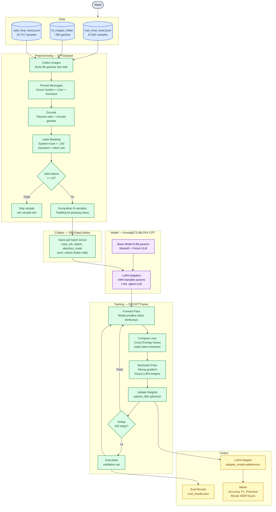

# Pipeline Training SFT DFK — KomdigiITS-8B

Panduan untuk menjalankan pipeline Supervised Fine-Tuning (SFT) model deteksi konten DFK (Disinformasi, Fitnah, Kebencian) berbasis multimodal (teks + gambar).

---

## Gambaran Umum

Pipeline ini melatih model `KomdigiITS-8B-DFK-CPT` agar bisa menganalisis konten media sosial dan mengklasifikasikannya ke dalam kategori:

- **Disinformasi** — konten yang menyebarkan informasi palsu atau hoax
- **Fitnah** — konten yang mencemarkan nama baik seseorang
- **Ujaran Kebencian** — konten yang mengandung hate speech
- **Fakta** — konten yang benar dan terverifikasi
- **Non-DFK** — konten yang tidak melanggar kategori apapun

---

## Alur Pipeline



---

## Struktur Folder

```
pipeline/
├── config.yaml                 ← semua hyperparameter
├── train.py                    ← entry point training
├── evaluate.py                 ← evaluasi model
├── chat_template.jinja         ← template format Mistral
├── requirements.txt
├── src/
│   ├── data_utils.py           ← DFKDataset + DFKDataCollator
│   ├── model_utils.py          ← load model + LoRA
│   └── training_utils.py       ← DFKSFTTrainer
└── scripts/
    └── download_images.py      ← download dataset gambar dari HF
```

---

## Penjelasan Proses SFT

### Apa itu SFT?

SFT (Supervised Fine-Tuning) adalah proses melatih model yang sudah punya pengetahuan umum agar bisa menjawab dengan format dan gaya tertentu. Base model sudah "pintar" secara umum, SFT mengajarinya cara menjawab sesuai task DFK.

```
Sebelum SFT:
  Input : "Apakah unggahan ini hoax?"
  Output: jawaban ngawur, format tidak konsisten

Setelah SFT:
  Input : "Apakah unggahan ini hoax?"
  Output: "Label: Disinformasi
            Alasan: Klaim bahwa ... tidak benar karena ..."
```

### Kenapa pakai LoRA?

Model aslinya punya 8.9 miliar parameter. Kalau semua ditraining, butuh VRAM sangat besar dan waktu sangat lama. LoRA bekerja dengan menambahkan adapter kecil di setiap layer yang ditarget — hanya adapter ini yang ditraining, bobot asli model tidak berubah sama sekali. Hasilnya training lebih cepat dan hemat memori, tapi kualitas tetap bagus.

### Label Masking

Ini yang membedakan SFT dari pre-training biasa. Dalam satu sample ada tiga bagian:

```
[SYSTEM] Kamu adalah analis konten...    ← diabaikan, tidak dihitung loss
[INST]   Ringkasan: Ada unggahan...      ← diabaikan, tidak dihitung loss
[/INST]  Label: Disinformasi             ← dihitung loss
         Alasan: Konten ini...           ← dihitung loss
```

Model hanya belajar memprediksi jawaban assistant, bukan pertanyaannya. Kalau tidak ada label masking, model malah ikut "belajar" dari pertanyaan yang tidak perlu.

### Text-only vs Multimodal

```
Text-only (68% data):
  Hanya teks ringkasan, klaim, fakta
  → Tokenizer proses teks → input_ids

Multimodal (32% data):
  Teks + gambar screenshot media sosial
  → Processor encode teks + gambar → input_ids + pixel_values
  → Vision encoder (Pixtral) ekstrak fitur visual
  → Digabung dengan token teks untuk diproses bersama
```

---

## Setup & Cara Menjalankan

### Yang dibutuhkan sebelum mulai

- Google Colab dengan GPU (A100 40GB / A100 80GB / H200)
- Google Drive yang sudah berisi:
  - `train_final_fixed.jsonl`
  - `valid_final_fixed.jsonl`
  - Folder gambar dari HF (`hf_images_folder`)
- HuggingFace token dengan akses ke model dan dataset

### Langkah 1 — Install dependencies

```python
!pip install "unsloth[colab-new] @ git+https://github.com/unslothai/unsloth.git" -q
!pip install trl transformers peft datasets pillow huggingface_hub \
             pyyaml bitsandbytes accelerate scikit-learn -q
```

Restart runtime setelah cell ini selesai, lalu lanjut ke langkah berikutnya.

### Langkah 2 — Mount Drive & clone repo

```python
from google.colab import drive, userdata
import os

drive.mount('/content/drive')
os.environ["HF_TOKEN"] = userdata.get("HF_TOKEN")

!git clone https://github.com/Lifunn/Pipeline-Training-SFT-DFK.git /content/pipeline
%cd /content/pipeline
```

### Langkah 3 — Download images (cukup sekali)

Kalau dataset gambar sudah ada di Drive, skip langkah ini.

```python
!python scripts/download_images.py \
    --hf_token $HF_TOKEN \
    --output_dir /content/drive/MyDrive/hf_images_folder
```

### Langkah 4 — Update config paths

```python
import yaml

DRIVE = "/content/drive/MyDrive"

with open("config.yaml") as f:
    cfg = yaml.safe_load(f)

cfg["data"]["train_file"] = f"{DRIVE}/train_final_fixed.jsonl"
cfg["data"]["eval_file"]  = f"{DRIVE}/valid_final_fixed.jsonl"
cfg["data"]["image_dir"]  = f"{DRIVE}/hf_images_folder"

with open("config.yaml", "w") as f:
    yaml.dump(cfg, f)

print("Config updated ✓")
```

### Langkah 5 — Smoke test

Jalankan ini dulu untuk memastikan pipeline berjalan tanpa error sebelum full training. Smoke test hanya pakai 80 samples dan 30 steps — cepat dan tidak makan waktu lama.

```python
!python train.py --smoke_test --hf_token $HF_TOKEN
```

### Langkah 6 — Full training

Kalau smoke test berhasil, langsung jalankan full training.

```python
!python train.py --hf_token $HF_TOKEN
```

### Langkah 7 — Backup hasil ke Drive

Output training ada di `/content/pipeline/output/dfk_sft/` yang akan hilang kalau session Colab berakhir. Backup ke Drive dulu setelah training selesai.

```python
import shutil

shutil.copytree(
    "./output/dfk_sft",
    "/content/drive/MyDrive/dfk_sft_output",
    dirs_exist_ok=True
)
print("Tersimpan ke Drive ✓")
```

### Langkah 8 — Evaluasi

```python
!python evaluate.py \
    --model_dir ./output/dfk_sft \
    --max_samples 300 \
    --output_json ./output/dfk_sft/eval_results.json \
    --hf_token $HF_TOKEN
```

---

## Konfigurasi

Semua parameter ada di `config.yaml`. Berikut yang paling sering perlu disesuaikan:

| Parameter | Default | Keterangan |
|-----------|---------|------------|
| `model.load_in_4bit` | false | Aktifkan kalau VRAM GPU kurang dari 50GB |
| `model.max_seq_length` | 4096 | Panjang maksimum token per sample |
| `lora.r` | 64 | Rank LoRA — makin besar makin banyak yang dipelajari |
| `lora.finetune_vision_layers` | true | Ikutkan vision encoder dalam training |
| `training.num_train_epochs` | 3 | Berapa kali seluruh dataset dilihat model |
| `training.learning_rate` | 2e-5 | Seberapa besar update bobot per step |
| `training.eval_steps` | 200 | Seberapa sering eval dijalankan |

---

## Statistik Dataset

| Split | Total | Text-only | Multimodal |
|-------|-------|-----------|------------|
| Train | 42,981 | 29,282 (68%) | 13,699 (32%) |
| Val   | 10,747 | 7,322 (68%) | 3,425 (32%) |

---

## Output Training

```
output/dfk_sft/
├── adapter_config.json          ← konfigurasi LoRA adapter
├── adapter_model.safetensors    ← bobot LoRA hasil training
├── tokenizer_config.json
├── tokenizer.json
├── processor_config.json
├── trainer_state.json           ← log loss per step
└── eval_results.json            ← hasil evaluasi
```

Yang tersimpan adalah LoRA adapter, bukan full model, karena bobot base model tidak berubah saat training. Untuk inference, adapter ini di-load di atas base model.
